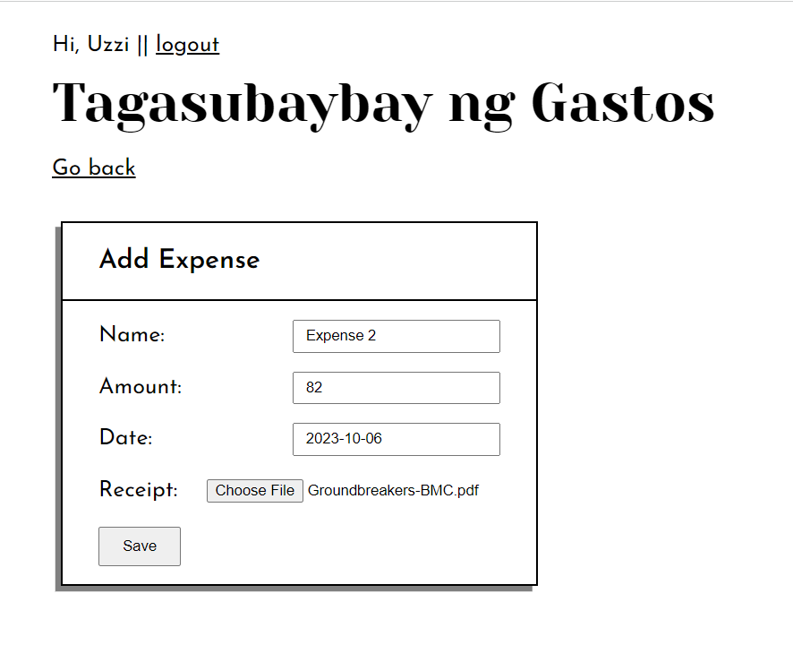

# Tagasubaybay ng Gastos

Tagasubaybay ng Gastos is a minimally designed expense tracker app that uses the basic CRUD operations.

## Dev Log

**2023-11-22:** Added user authentication and creation, and file uploading.

**2023-11-19:** Added update and delete operations, implemented basic designs, and added login form.

**2023-11-17:** Added create and read operations.

**2023-11-16:** Addded home page and expense form page.

**2023-11-15:** Initial configurations.

## Features

### Login

### Register

### View Expenses

### Add Expense

### Edit Expense

### Delete Expense

## Contributors

- [@UzziKyle](https://github.com/UzziKyle)

## License

[MIT](LICENSE) © [uzzi](https://uzzikyle.github.io/)
